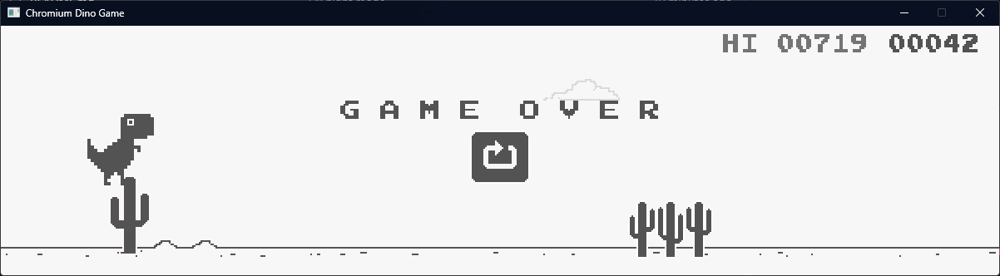
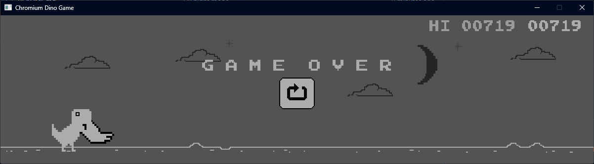

# Chrome Dino Game (C++)

## Keybinds

- Jump = UP/SPACE/A
- Duck = DOWN/B
- Restart = ENTER/START
- Exit = ESCAPE

## Missing features from the original

- System for seasonal themes (e.g. custom floating objects, custom obstacles, custom collectables)
- Accessibility features (e.g. synthesized obstacle warning, slow game mode)

## Screenshots

