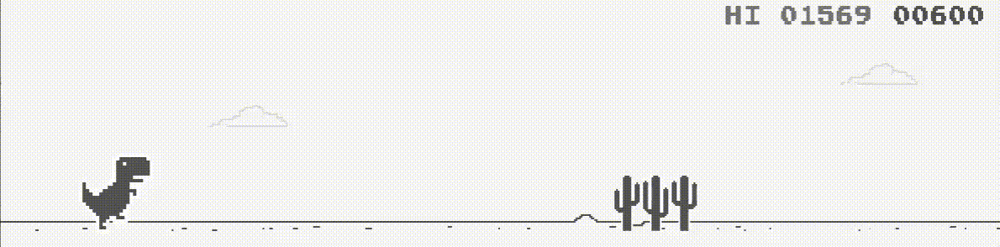

# Chrome Dino Game (C++)

(Click for uncompressed video, do note capture **lags** a bit more than usual)

There are configs for both UWP (Xbox) and win32. (use -DXBOX=ON to enable UWP)

## Keybinds

|Control|Keyboard|Gamepad|
|--:|:-:|:--|
|JUMP|`UP`, `SPACE`|`A`|
|DUCK|`DOWN`|`B`|
|RESTART|`ENTER`|`≡`|
|EXIT|`ESCAPE`|N/A|

## Missing features from the original

- System for seasonal themes (e.g. custom floating objects, custom obstacles, custom collectables)
- Accessibility features (e.g. synthesized obstacle warning, slow game mode)
