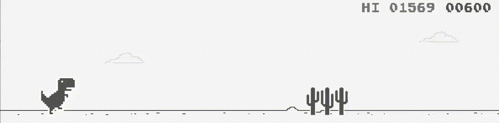

# Chrome Dino Game (C++)

[](screens/video.mp4)
<sub>(Click for uncompressed video, do note capture **lags** a bit more than usual)</sub>

There are configs for both UWP (Xbox), PS2, and win32/posix. (use -DXBOX=ON to enable UWP)

## Keybinds

|Control|Keyboard|Gamepad|
|--:|:-:|:--|
|JUMP|`UP`, `SPACE`|`A`/|
|DUCK|`DOWN`|`X`/|
|START/RESTART|`ENTER`|`≡`/|
|EXIT|`ESCAPE`|N/A|
|Clear high score|Double-click `HI`|`LB`/|

## Missing features from the original

- System for seasonal themes (e.g. custom floating objects, custom obstacles, custom collectables)
- Accessibility features (e.g. synthesized obstacle warning, slow game mode)
---
To build for Android, open the android-build folder in Android Studio. Once inside, allow the project to load. Then set the variant to `Release`. Use `Build` -> `Build APKs` to build the APK file. Finally, click `locate` inside the popup.

PS2 build:

```bash
git clone --depth=1 https://github.com/DanielLMcGuire/chrome-dino-cpp.git
cd chrome-dino-cpp
export PS2DEV=$HOME/ps2dev
export PS2SDK=$PS2DEV/ps2sdk
export GSKIT=$PS2DEV/gsKit
export PATH=$PATH:$PS2DEV/bin:$PS2DEV/ee/bin:$PS2DEV/iop/bin:$PS2DEV/dvp/bin:$PS2SDK/bin
mkdir -p $PS2DEV
curl -o ps2dev-latest.tar.gz -LC - \
  https://github.com/ps2dev/ps2dev/releases/download/latest/ps2dev-ubuntu-latest.tar.gz
tar -xf ps2dev-latest.tar.gz --strip-components 1 -C $PS2DEV
cmake -B build-ps2 -DCMAKE_TOOLCHAIN_FILE=$PS2SDK/ps2dev.cmake -DPS2=ON # OR -DPCSX2=ON \
  -DCMAKE_BUILD_TYPE=Release
cmake --build build-ps2 -j$(nproc)
# pcsx2 build-ps2/DINOGAME.ELF
```

Xbox:

```bash
cd ~
git clone --depth 1 --recurse-submodules --shallow-submodules https://github.com/XboxDev/nxdk.git
git clone --depth=1 https://github.com/DanielLMcGuire/chrome-dino-cpp.git
cd chrome-dino-cpp
eval "$(~/nxdk/bin/activate -s)"
make -f Makefile.nxdk
# xemu -dvd_path DinoGame.iso
```
